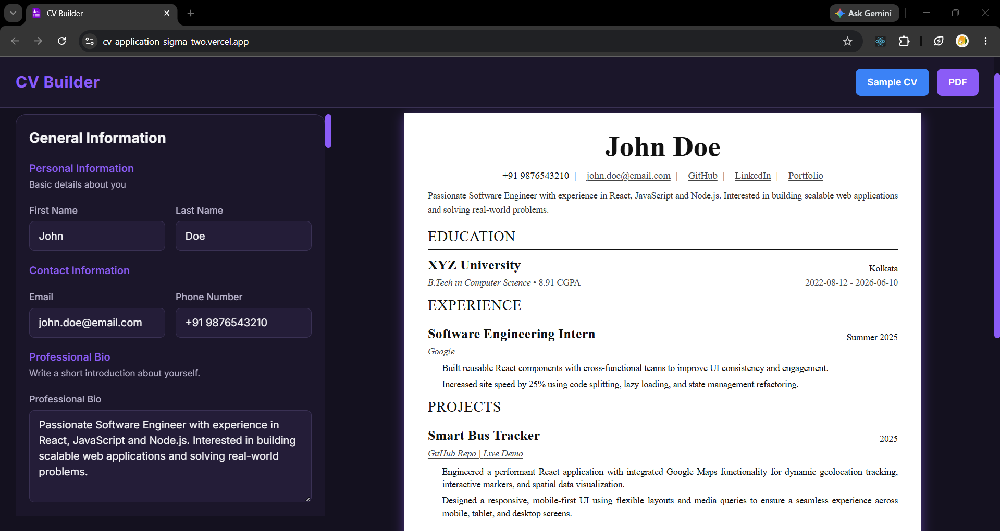
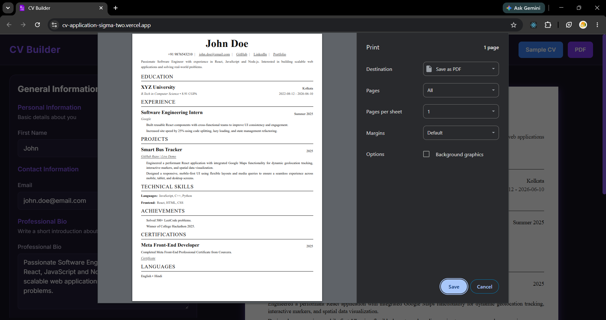

# CV Builder

A modern, responsive CV/Resume Builder built with **React** and **Vite**.

Create professional resumes by filling out an interactive form and previewing the result in real time. The application supports multiple education records, work experiences, projects, certifications, skills, achievements, languages, custom links, and one-click PDF export.

---

## Demo

> Live Demo: https://cv-application-sigma-two.vercel.app/

---

## Screenshots

### Home




### PDF Output



---

# Features

## General Information

- First & Last Name
- Email Address
- Phone Number
- Professional Summary
- Multiple Contact Links
    - LinkedIn
    - GitHub
    - Portfolio
    - LeetCode
    - HackerRank
    - Codeforces
    - Website
    - Custom Links

---

## Education

Add multiple educational qualifications.

Each education entry includes:

- School / University
- Degree / Course
- Place
- Grade / CGPA
- Date Duration
- Custom Duration
- Currently Studying option

---

## Work Experience

Supports unlimited work experiences.

Each entry contains:

- Company Name
- Position
- Responsibilities
- Multiple bullet points
- Date Duration
- Custom Duration
- Present Job option

---

## Projects

Create multiple projects with:

- Project Title
- Description
- Multiple Project Links
- GitHub Repository
- Live Demo
- Custom Links
- Date Duration
- Custom Duration

---

## Technical Skills

Organize skills by category.

Example:

Languages
- C++
- Java
- JavaScript

Frontend
- React
- HTML
- CSS

Backend
- Node.js
- Express

Each category supports unlimited skills.

---

## Certifications

Each certification supports:

- Title
- Description
- Certificate Link
- Custom Links
- Date Duration
- Custom Duration

---

## Achievements

Add unlimited achievements or awards.

Example:

- Winner of Hackathon
- Solved 500+ LeetCode Problems
- Google Developer Student Clubs Member

---

## Languages

Add unlimited languages.

Example:

- English
- Hindi
- Bengali

---

## Sample CV

Load a fully populated sample resume with one click to quickly explore the application's features.

---

## Live Preview

Every form update is instantly reflected in the CV preview.

No page refresh required.

---

## PDF Export

Export your CV directly from the browser using:

- react-to-print

The exported document is optimized for:

- A4 Paper
- Clean margins
- Printable layout
- Clickable links

---

## Responsive Design

Works across:

- Desktop
- Tablet
- Mobile

On mobile devices:

- Edit Mode
- Preview Mode

can be switched without cluttering the screen.

---

# Built With

- React
- Vite
- JavaScript (ES6+)
- CSS3
- HTML5
- react-to-print

---

# Project Structure

```
src
│
├── components
│   ├── forms
│   │   ├── Achievement.jsx
│   │   ├── Certification.jsx
│   │   ├── EducationExp.jsx
│   │   ├── GeneralInfo.jsx
│   │   ├── Language.jsx
│   │   ├── PracticalExp.jsx
│   │   ├── Projects.jsx
│   │   └── Skill.jsx
│   │
│   ├── layout
│   │   ├── CvPreview.jsx
│   │   ├── HeaderBar.jsx
│   │   └── LeftSideBarForm.jsx
│   │
│   └── reusables
│       ├── ActionButtons.jsx
│       ├── DateRow.jsx
│       ├── DurationInput.jsx
│       ├── DynamicList.jsx
│       ├── FormCard.jsx
│       ├── FormGroup.jsx
│       ├── InputRow.jsx
│       ├── LinkCard.jsx
│       └── SectionTitle.jsx
│
├── data
│   └── sampleData.js
│
├── styles
│   ├── layout
│   │   ├── CvPreview.css
│   │   ├── HeaderBar.css
│   │   └── LeftSideBarForm.css
│   │
│   ├── App.css
│   └── Common.css
│
├── App.jsx
├── index.css
└── main.jsx
```

---

# Installation

Clone the repository

```bash
git clone https://github.com/abhirup-2005/cv_application
```

Move into the project

```bash
cd cv-builder
```

Install dependencies

```bash
npm install
```

Start the development server

```bash
npm run dev
```

Build for production

```bash
npm run build
```

Preview production build

```bash
npm run preview
```

---

# Design Principles

This project follows a component-based architecture.

### Reusable Components

Examples include:

- FormCard
- DynamicList
- DurationInput
- FormGroup
- ActionButtons
- LinkCard
- SectionTitle

This keeps the codebase modular and reduces duplication.

---

# Future Improvements

Potential features include:

- Multiple Resume Templates
- Drag & Drop Section Reordering
- Resume Themes
- Font Selection
- Accent Color Customization
- Dark/Light Mode
- Import Resume Data
- Export as JSON
- Save Resume to Local Storage
- Multiple Resume Profiles
- ATS Score Checker
- Markdown Support
- Profile Photo Upload

---

# License

This project is licensed under the MIT License.

Feel free to use, modify and distribute it.

---

# Author

**Abhirup Sengupta**

GitHub:
https://github.com/abhirup-2005

LinkedIn:
https://www.linkedin.com/in/abhirup-sengupta/